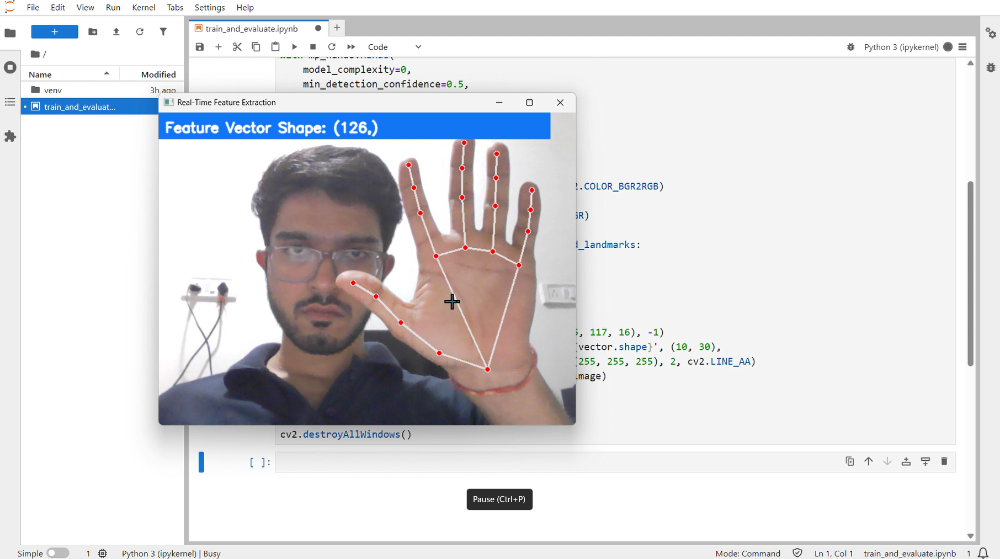

# AI-Powered Real-Time Sign Language Translator



**Status: Milestone 1 of 4 (ML Module) Complete.** This repository documents the development of a deep learning project to translate Indian Sign Language (ISL)  in real-time. The foundational feature extraction pipeline is fully functional.

---

## 🌟 About The Project

Communication is a fundamental human right, yet significant barriers exist for the deaf and hard-of-hearing community. This project aims to bridge that gap by leveraging computer vision and deep learning to create a seamless, real-time sign language to speech translator.

The core of this project will be an **LSTM (Long Short-Term Memory)** neural network trained on keypoint data extracted from hand gestures. This repository currently contains the first major component: a robust pipeline for real-time gesture data extraction using Google's MediaPipe framework.

### ✨ Key Features (Current)

*   **Real-Time Feature Extraction:** A high-performance pipeline that captures gestures from a webcam and converts them into a 126-dimensional feature vector, ready for machine learning.
*   **Engineered for Accuracy:** The pipeline captures the 3D coordinates of 21 key points on each hand, providing rich data for a future high-accuracy model.
*   **Efficient Landmark Processing:** Processes lightweight landmark data, not heavy video frames, ensuring low latency and the ability to run on consumer-grade hardware.
*   **Scalable Foundation:** The structured approach makes it easy to move to the next phase of data collection and model training.

### 🛠️ Built With

*   **Python 3.13.5**
*   **OpenCV:** For handling the real-time camera feed.
*   **MediaPipe:** For high-fidelity, real-time hand landmark detection.
*   **NumPy:** For efficient numerical operations and vector manipulation.
*   *(Upcoming: TensorFlow, Scikit-learn, Jupyter Lab for model training)*

---

## 🚀 Getting Started

Follow these instructions to get the current version of the project (the feature extraction pipeline) running on your local machine.

### Prerequisites

You need to have Python installed on your system. It's highly recommended to use a virtual environment.

### ⚙️ Installation

1.  **Clone the repository:**
    ```sh
    git clone https://github.com/GautamSutar/AI-powered-Sign-Language-Translator.git
    ```
2.  **Navigate to the project directory:**
    ```sh
    cd AI-powered-Sign-Language-Translator
    ```
3.  **Create and activate a virtual environment:**
    *   On Windows:
        ```sh
        python -m venv venv
        venv\Scripts\activate
        ```
    *   On macOS/Linux:
        ```sh
        python -m venv venv
        source venv/bin/activate
        ```
4.  **Install the required dependencies:**
    ```sh
    pip install -r requirements.txt
    ```

### 🏃‍♀️ Running the Demo

To see the real-time feature extraction pipeline in action, run the following script. It will activate your webcam and display the detected hand landmarks along with the shape of the feature vector being generated.

```sh
python Ai/realtime_feature_extractor.py
```

---

## 📁 Project Structure (Current)

```
AI-powered-Sign-Language-Translator/
│
├── realtime_feature_extractor.py          # Core script for Milestone 1 (real-time feature extraction)
├── requirements.txt                       # Project dependencies
├── README.md                              # Project documentation
│
├── train_and_evaluate.ipynb               # Model training & evaluation notebook
│
├── .ipynb_checkpoints/                    # Auto-generated Jupyter backups
│   └── train_and_evaluate-checkpoint.ipynb

```

---

## 🗺️ Project Progress & Roadmap

This project is being built in distinct milestones. Here is the current progress:

*   [x] **Milestone 1: Real-Time Feature Extraction Pipeline:** Build a robust script to capture and process hand landmark data from a live webcam feed.
*   [ ] **Milestone 2: Data Collection & Model Training:** Develop the data collection script and train the LSTM model in a Jupyter Notebook.
*   [ ] **Milestone 3: Live Inference Engine:** Create the final script to load the trained model and perform live sign language prediction.
*   [ ] **Phase 2: Backend API:** Develop a REST API (using FastAPI or Django) to serve the trained model.
*   [ ] **Phase 3: Frontend Interface:** Build a user-friendly web interface using React and TypeScript.
*   [ ] **Phase 4: Deployment:** Containerize the services with Docker and deploy to a cloud platform.

---

## 📜 License

Distributed under the MIT License. See `LICENSE` for more information.

---

## 📞 Contact

Gautam Sutar - [LinkedIn Profile](https://www.linkedin.com/in/gautamsutar/) - gautamsutar.in@gmail.com

Project Link: [https://github.com/GautamSutar/AI-powered-Sign-Language-Translator](https://github.com/GautamSutar/AI-powered-Sign-Language-Translator)